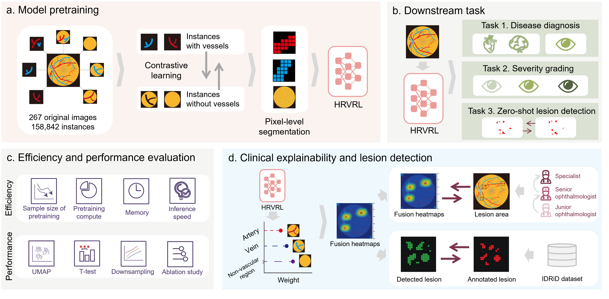

<h1>HRVRL： An Efficient and Interpretable Foundation Model for Retinal Image Analysis in Disease Diagnosis</h1>

- <h3> Framework </h3>

<div style="text-align: center">
  
</div>

- <h3> Environment Requirements</h3>

```shell
conda create -n hrvrl python=3.10 -y
conda activate hrvrl
pip install poetry 
poetry install
pip install tensorflow==2.9.1
pip install torch==1.13.1 torchvision torchaudio --extra-index-url https://download.pytorch.org/whl/cu117 --force
```

> <span style='color:red'>if you encounter the following problem</span>:
> AttributeError: module 'tensorflow' has no attribute 'GraphKeys'
> `vim /home/xxx/.conda/envs/xxx/lib/python3.10/site-packages/tensorlayer/layers.py`
> `import tensorflow as tf ---> import tensorflow.compat.v1 as tf`
<<<<<<< Updated upstream
> `pip install pycm==4.1`
=======
>
> `pip install pycm==4.1 ` 

>>>>>>> Stashed changes
